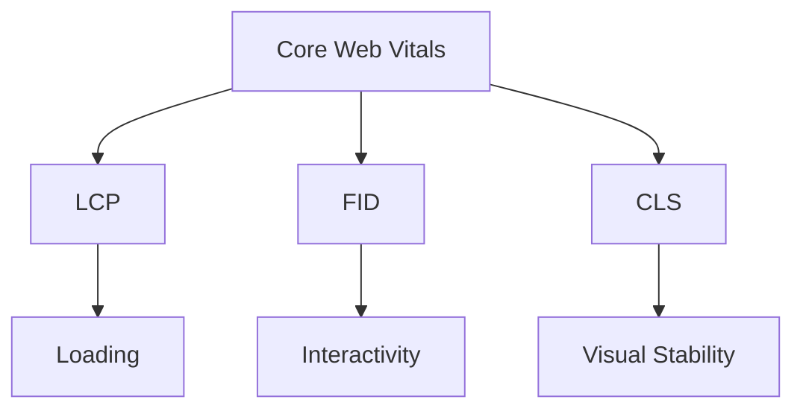
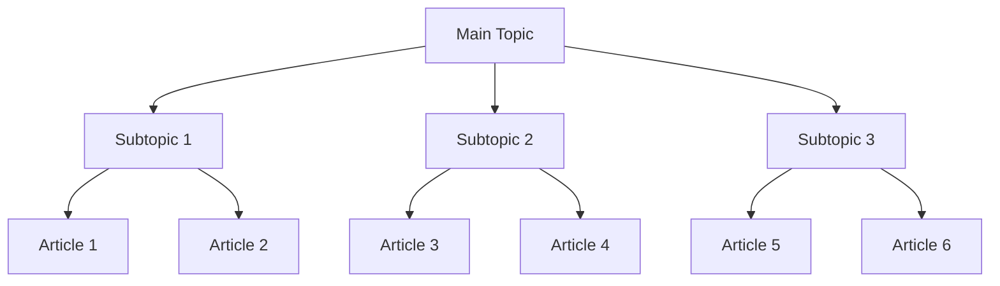

# SEO Trends and Best Practices 2024

Mastering Organic SEO for SERP Excellence

  
    Press Space for next page <carbon:arrow-right class="inline"/>
  

---

# Key SEO Trends in 2024

1. AI and Machine Learning in Search
2. Mobile-First Indexing
3. Voice Search Optimization
4. Core Web Vitals
5. E-A-T (Expertise, Authoritativeness, Trustworthiness)
6. Video Content Optimization
7. Semantic Search and Topic Clusters

---

# AI and Machine Learning in Search

- Google's AI algorithm: RankBrain and BERT
- Content quality and relevance are more important than ever
- AI-powered content creation and optimization tools
- Personalized search results based on user behavior

---

# Mobile-First Indexing

- Mobile-friendly design is crucial
- Responsive layouts and fast loading times
- Optimized images and media for mobile devices
- Mobile-specific features (e.g., click-to-call, local search)

---

# Voice Search Optimization

- Focus on natural language and conversational keywords
- Long-tail keywords and question-based queries
- Featured snippets optimization
- Local SEO for voice search

---

# Core Web Vitals

- Largest Contentful Paint (LCP)
- First Input Delay (FID)
- Cumulative Layout Shift (CLS)

---

# E-A-T: Expertise, Authoritativeness, Trustworthiness

- High-quality, expert-written content
- Author bios and credentials
- Backlinks from reputable sources
- Regular content updates and fact-checking

---

# Video Content Optimization

- YouTube SEO (titles, descriptions, tags)
- Video transcripts and closed captions
- Video sitemaps
- Embedding videos on your website

---

# Semantic Search and Topic Clusters

- Focus on topics rather than just keywords
- Create comprehensive, interlinked content
- Use schema markup for rich snippets
- Optimize for user intent

---

# Key Takeaways for SEO Success in 2024

1. Embrace AI and machine learning in your SEO strategy
2. Prioritize mobile optimization
3. Optimize for voice search and featured snippets
4. Improve Core Web Vitals scores
5. Build E-A-T through high-quality content and authoritative backlinks
6. Incorporate video content in your SEO efforts
7. Focus on semantic search and comprehensive topic coverage

---
layout: center
class: text-center
---

# Thank You!

Stay ahead in the SEO game by adapting to these trends